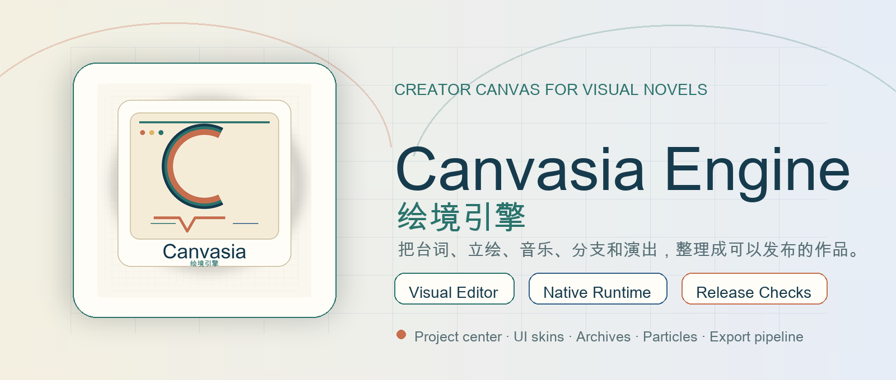
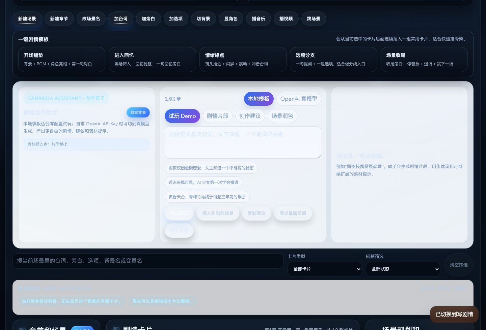
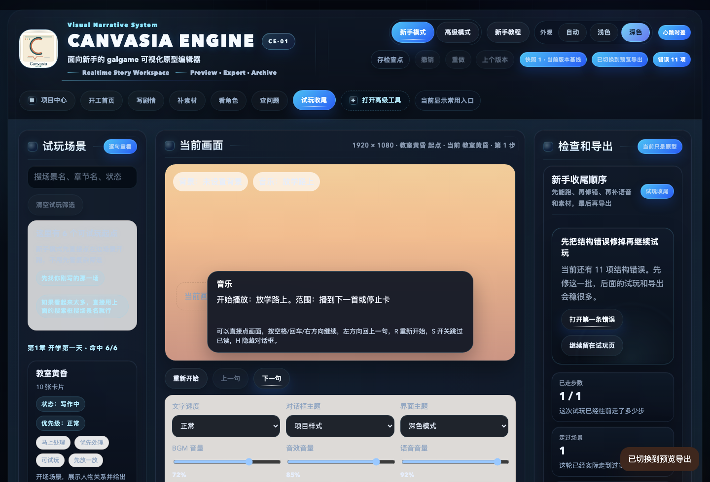

<p align="center">
  
</p>

<h1 align="center">Canvasia Engine</h1>

<p align="center">
  A creator-friendly visual novel / galgame engine prototype.<br />
  Build playable stories with assets, dialogue, buttons, previews, and export tools instead of code.
</p>

<p align="center">
  
  
  
  
</p>

<p align="center">
  <strong>Language</strong>:
  <a href="README.zh-CN.md">简体中文</a> ·
  English ·
  <a href="README.ja-JP.md">日本語</a>
</p>

<p align="center">
  <a href="#quick-start">Quick Start</a> ·
  <a href="#core-features">Core Features</a> ·
  <a href="#feature-status">Feature Status</a> ·
  <a href="#exports">Exports</a> ·
  <a href="#project-site-and-share-kit">Share Kit</a> ·
  <a href="#testing">Testing</a> ·
  <a href="CONTRIBUTING.md">Contributing</a>
</p>

---

## Project Positioning

Canvasia Engine is currently a source-available preview for visual novel and galgame creators.

It is best suited for:

- trying small visual novel prototypes
- testing editor and export workflows
- building small creator projects
- collecting feedback before a stable commercial release

The project already includes a visual editor, export pipeline, native runtime preview, project recovery tools, and automated smoke tests. It is still published as **Preview / Early Access** because signing, notarization, installers, and long manual QA still need more release hardening.

## Core Features

- Visual story editor with scenes, cards, dialogue, narration, choices, variables, and conditional branches
- Project center with playable Demo projects, blank projects, beginner mode, and advanced mode
- Context-aware Command Palette with Cmd/Ctrl+K quick actions for project setup, navigation, recommended next steps, recent commands, story card insertion, a previewed first-playable-scene template, themes, tutorial access, and export flow
- Plain-text script import that previews and turns `Character: line`, narration lines, and consecutive choice lines into editable story cards
- Asset management for backgrounds, character sprites, CGs, BGM, SFX, voice, fonts, UI assets, Live2D files, 3D models, and 3D scenes, with dependency reports that show where each asset is used
- Multi-language project settings for default language and player-selectable languages
- Localized runtime text for scene names, chapter names, dialogue, choices, and character names, with safe fallback when a translation is missing
- Localization coverage checks with Markdown / CSV exports and safe CSV re-import for character, chapter, scene, and story-card translations
- Canvasia Assistant with local template mode and optional creator-provided OpenAI, DeepSeek, Qwen, Kimi, Zhipu GLM, or compatible API providers
- Optional OpenAI Image asset generation for backgrounds, sprites, CGs, and UI materials, with style-hint presets, sprite-to-character expression binding, prompt/model validation, and local-only API key handling
- Formal save/load, quick save/load, system menu, text history, autoplay, skip-read, and voice replay
- Entry reachability route analysis for broken links, orphan scenes, unreachable scenes, branch depth, ending candidates, playable ending path previews, and exportable route QA checklists
- Custom game UI skins, UI Kit binding, nine-slice textures, button states, layout controls, and visual novel textbox design
- Extra galleries: CG replay, music room, character archive, location archive, narration archive, relationship archive, achievements, chapter replay, ending replay, and voice replay
- Advanced particle presets, project particle libraries, camera effects, screen filters, flashes, shakes, and fade transitions
- Live2D / 3D character and 3D scene asset import, plus native-runtime 3D inspection reports for glTF / GLB / VRM assets
- Web playable export, desktop exports, editor desktop builds, and native Runtime preview packages
- Automated checks: local CI precheck, backend smoke tests, Playwright browser smoke tests, action wiring scans, branch-aware preview regression with condition / fallback variable presets, release-control reports, scene production boards, choice consequence audits, variable influence audits, asset dependency audits, BGM cue-sheet audits, character stage-direction audits, presentation timeline audits, tester handoff work orders, playtest feedback templates and feedback intake summaries, VN baseline quality audits, and package integrity verification

## Feature Status

| Area | Status | Notes |
| --- | --- | --- |
| Story and Branch Editing | Available | Visual cards, choices, jumps, variables, conditions, entry reachability route checks, scene production boards, variable influence reports, scene graph inspection, and plain-text script-to-card import. |
| Asset Management | Available | Import, replace, delete, usage protection, dependency reports, file-size budget hints, and optional OpenAI Image generation with style presets, sprite expression binding, prompt, model, format, and returned-file validation. |
| Multi-language / i18n | Preview | Project language settings, localization coverage reports, safe CSV re-import for character, chapter, scene, and story-card translations, export metadata, Web Runtime language switching, native Runtime language switching, and fallback behavior. |
| Canvasia Assistant | Available | Local template mode plus optional creator-owned API keys for major compatible providers. |
| Project Safety Net | Available | Snapshots, restore, crash recovery, project doctor, repair queue, release gates, release-control reports, and VN baseline quality checks for placeholder content, character sprites, backgrounds, BGM, choices, text density, and presentation polish. |
| Game UI Customization | Available | Project UI skins, button states, nine-slice images, layout tuning, and textbox styling. |
| Extras / Replay Systems | Available | CG, music, character, location, narration, relationship, achievement, chapter, ending, and voice replay systems. |
| Particles and Presentation | Available | Particle presets, custom particle settings, camera, filters, flashes, shakes, fades, and character presentation effects. |
| Live2D / 3D Assets | Preview | Live2D, 3D character models, and 3D scene assets can be imported; native Runtime exports 3D structure and risk reports. |
| Web / Desktop Exports | Preview | Web playable packages and desktop packages are available; signing and notarization depend on release notes. |
| Native Runtime | Preview | Covers the core playback path, settings, saves, history, autoplay, video fallback, 3D reports, and first archive systems. |
| Mobile Runtime | Experimental planning | Touch, audio policy, and layout adaptation are still being explored. |

## Screenshots

| Story Editor and Assistant | Preview and Export |
| --- | --- |
|  |  |
| Visual story cards, scene structure, Canvasia Assistant, idea vault, and insertable generated cards. | Preview, runtime settings, release checks, and multi-platform export entry points. |

## Project Site and Share Kit

- Landing page source: [`docs/index.html`](docs/index.html)
- Social preview image: [`docs/github/canvasia-social-preview.png`](docs/github/canvasia-social-preview.png)
- Exposure kit: [`docs/marketing/exposure-kit.md`](docs/marketing/exposure-kit.md)
- Expected GitHub Pages URL after enabling Pages from `/docs`: `https://tonyna-code.github.io/canvasia-engine/`

## Repository Layout

- [`run_editor.py`](run_editor.py): local editor server, project management, export pipeline, and packaging entry point
- [`editor_local_security.py`](editor_local_security.py): loopback-only API request guard helpers
- [`editor_snapshot_cache.py`](editor_snapshot_cache.py): reusable file-signature snapshot cache for read-heavy editor payloads
- [`prototype_editor`](prototype_editor): visual editor frontend
- [`prototype_editor/modules`](prototype_editor/modules): frontend pure-logic modules for route analysis, story templates, editor helpers, assistant workflows, release checks, and other testable editor capabilities
- [`export_player_template`](export_player_template): exported Web Runtime template
- [`native_runtime`](native_runtime): native Runtime player and related desktop runtime logic
- [`template_project`](template_project): blank starter project template
- [`tests`](tests): automated smoke and regression tests
- [`docs/maintainer-guide.md`](docs/maintainer-guide.md): maintenance boundaries, safe extension pattern, and recommended checks

## Quick Start

The editor only requires Python 3 for the source-based path.

If this is your first time opening Canvasia, follow the short route below:

1. Launch the editor.
2. In Project Center, create a playable Demo project.
3. Click through preview once to confirm the first scene, character, BGM, and dialogue all run.
4. Replace the placeholder assets and lines with your own story.
5. If you prefer a completely clean workspace, create a blank project and use the starter kit when you are ready.

### One-click scripts

- macOS: double-click [`start_editor.command`](start_editor.command)
- Windows: double-click [`start_editor.cmd`](start_editor.cmd)
- Linux: run [`start_editor.sh`](start_editor.sh)

### Command line

macOS / Linux:

```bash
git clone https://github.com/TonyNa-code/canvasia-engine.git
cd canvasia-engine
python3 run_editor.py
```

Windows:

```bat
git clone https://github.com/TonyNa-code/canvasia-engine.git
cd canvasia-engine
py -3 run_editor.py
```

If the Windows `py` launcher is unavailable, try:

```bat
python run_editor.py
```

After launch, the editor opens in your browser on a local `127.0.0.1` address. The project files stay on your computer.

## Recommended First Project

For a first five-minute demo, start small:

- 1 background
- 1 character sprite
- 1 BGM track
- 10 to 20 lines of dialogue
- 1 choice
- 1 simple ending

Build one complete path first, then add branches, effects, UI skins, galleries, voice, and extra polish.
The playable Demo project gives you that skeleton immediately. If you start from a blank project instead, the starter kit can create the first character/background/BGM records and connect them to the first scene, so you do not have to wire every card by hand.

If your draft already lives in a document or notes app, paste a short section into the story page's script import panel. `Character: dialogue` becomes dialogue, plain lines become narration, and consecutive `- choice` lines become one choice card after preview.

## Multi-language Projects

Canvasia supports a first i18n workflow:

1. Finish the main story in your primary language.
2. Open project runtime settings and choose the default language.
3. Enable player-selectable languages such as `zh-CN`, `ja-JP`, or `en-US`.
4. Add translations for character names, scene names, chapter names, dialogue, narration, and choices.
5. Open the inspection center and export a localization coverage report or CSV if you want a translator-friendly checklist.
6. Fill the translation column in the CSV and import it back to write supported character, chapter, scene, and story-card translations into the project.
7. Export and switch language in the Web Runtime or native Runtime settings menu.

If a translation is missing, the runtime falls back to the default text instead of breaking the game.

## Exports

Open a project and go to the preview/export area to generate:

- Web playable package
- Windows desktop package
- macOS desktop package
- Linux desktop package
- Native Runtime package preview with standalone-app build scaffolding

The Web playable package is the easiest option for quick sharing. The native Runtime package is the route for testing a more app-like desktop playback flow.

## Release Packages

Preview editor builds are distributed through GitHub Releases when available:

- `macos.tar.gz`
- `windows.zip`
- `linux.tar.gz`

Unsigned preview builds may trigger macOS Gatekeeper, Windows SmartScreen, or antivirus warnings. Download only from the official repository release page and verify SHA-256 files when provided.

## Testing

Useful local checks:

```bash
python3 -m unittest tests.test_run_editor_smoke -v
python3 -m unittest tests.test_frontend_particle_effects_module -v
node --check prototype_editor/app.js
node --check export_player_template/player.js
```

Some browser or native-rendering checks may require additional local dependencies.

## License

This project uses the Creator License 1.0 included in [`LICENSE`](LICENSE). Games made with the engine may be commercialized, while redistribution or commercialization of modified engine copies is limited by the license terms.

## Contributing

Contributions are welcome. Please read [`CONTRIBUTING.md`](CONTRIBUTING.md), [`CODE_OF_CONDUCT.md`](CODE_OF_CONDUCT.md), and [`SECURITY.md`](SECURITY.md) before opening issues or pull requests.
