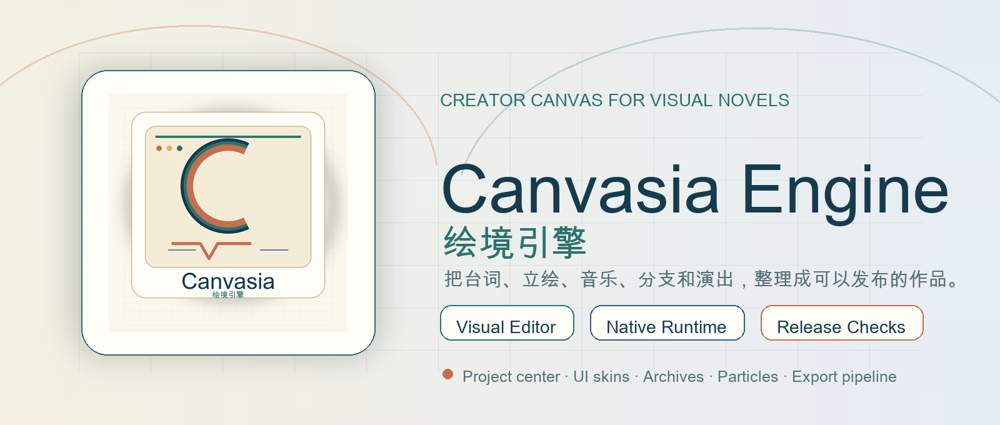
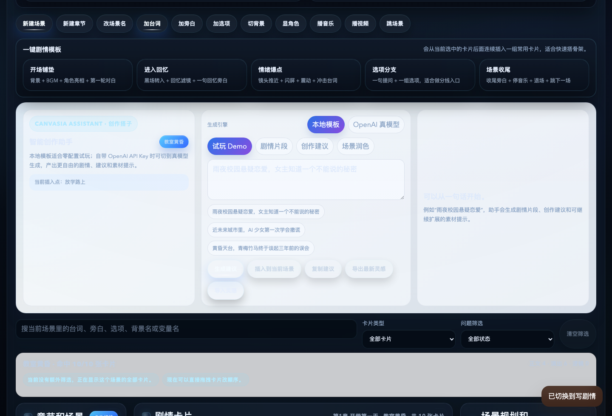
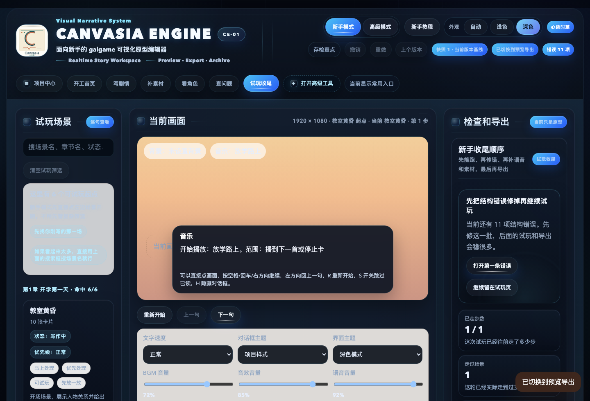

<p align="center">
  
</p>

<h1 align="center">Canvasia Engine</h1>

<p align="center">
  A creator-friendly visual novel / galgame engine prototype.<br />
  Build playable stories with assets, dialogue, buttons, previews, and export tools instead of code.
</p>

<p align="center">
  
  
  
  
</p>

<p align="center">
  <strong>Language</strong>:
  <a href="README.zh-CN.md">简体中文</a> ·
  English ·
  <a href="README.ja-JP.md">日本語</a>
</p>

<p align="center">
  <a href="#quick-start">Quick Start</a> ·
  <a href="#core-features">Core Features</a> ·
  <a href="#feature-status">Feature Status</a> ·
  <a href="#exports">Exports</a> ·
  <a href="#project-site-and-share-kit">Share Kit</a> ·
  <a href="#testing">Testing</a> ·
  <a href="CONTRIBUTING.md">Contributing</a>
</p>

---

## Project Positioning

Canvasia Engine is currently a source-available preview for visual novel and galgame creators.

It is best suited for:

- trying small visual novel prototypes
- testing editor and export workflows
- building small creator projects
- collecting feedback before a stable commercial release

The project already includes a visual editor, export pipeline, native runtime preview, project recovery tools, and automated smoke tests. It is still published as **Preview / Early Access** because signing, notarization, installers, and long manual QA still need more release hardening.

## Core Features

- Visual story editor with scenes, cards, dialogue, narration, choices, variables, and conditional branches; each choice can stay available, hide, or remain visibly locked until affection, inventory, route flags, or other variable rules are satisfied
- Story-card clip selection for larger scenes: select individual cards or Shift-select a range, then move, duplicate, or delete the selection as one undoable project-history operation; invalid BGM end ranges are repaired safely after structural edits
- Safe project-wide text refactoring for names, terminology, dialogue, narration, choices, input prompts, scenes, and chapters, with selectable scopes, optional translation updates, a before/after preview, stale-preview protection, transactional rollback, and one-step project-history undo
- Optional timed choices with 5 / 10 / 15 / 30-second presets or a custom 1-300 second limit, an author-selected timeout branch, safe fallback when that branch is locked, pause-aware menus and background tabs, and remaining-time restoration across editor preview, Web Runtime, native Runtime, saves, and Ren'Py export
- Inline dialogue pacing with beginner-friendly buttons for short / long pauses and selected-text slow, fast, or instant reveal; editor preview, Web Runtime, native Runtime, saves, history, archives, and Ren'Py drafts share the same marker-safe behavior, while a player's Instant text-speed preference always takes priority
- Rich story text with no-code selected-text buttons for emphasis, whisper, safe custom colors, and ruby / furigana; rich styling composes with inline pacing and stays aligned across editor preview, Web Runtime, native Runtime, clean save/history/archive text, and Ren'Py draft export without accepting raw HTML
- Player input cards for names, passwords, investigation answers, and numeric values, with `{{variable_id}}` interpolation in dialogue, narration, choices, and locked-choice hints across Web Runtime, native Runtime, saves, and Ren'Py draft export
- Reusable sub-scenes with nested `call` / automatic or early return flow for shared events, phone calls, tutorials, and recurring sequences; the call stack survives preview, Web, and native Runtime saves, and exports as native Ren'Py `call` / `return`
- Project center with playable Demo projects, blank projects, beginner mode, advanced mode, and a six-stage creator workflow guide from project setup to Release Candidate export
- Context-aware Command Palette with Cmd/Ctrl+K quick actions for project setup, navigation, recommended next steps, recent commands, story card insertion, a previewed first-playable-scene template, themes, tutorial access, and export flow
- Production-ready scene recipes for OP hooks, daily dialogue rhythm, affection choices, mystery clues, relationship reveals, branch merges, climax direction, ED / credits, BGM range scoping, and variable-backed branch consequences
- Scene mood recipes that insert editable camera, filter, particle, pause, flash, shake, BGM, and fade cards for common VN beats such as confession focus, mystery pressure, rainy memory, climax impact, and quiet endings
- Independent stage-image cards for props, foreground artwork, overlays, cut-ins, letters, and effect textures, with show / update / hide actions, named layers, back / front planes, position, offset, width, opacity, rotation, flip, stacking order, duration, and easing controls shared by editor preview, Web Runtime, native Runtime, and Ren'Py draft export
- Plain-text and Ren'Py-style script import that previews `Character: line`, quoted dialogue, narration, choices with `[affection +1; flag=true]` consequences, `scene`, `show`, `move`, `hide`, `show / move ... scale / x / y / opacity / layer / flip / duration / easing`, `stage image show / update / hide`, per-line `speed slow / normal / fast / instant`, standalone variable cues such as `set route = common` and `add affection +1`, `if affection >= 2 -> good else -> normal`, `play / stop music`, `play sound`, `play video`, `wait / pause`, `shake`, `flash`, `zoom`, `pan`, `filter`, `blur`, `particle`, `credits`, `voice`, `jump`, `call`, and `return` cues as editable story / staging / text-speed / variable / condition / audio / video / timing / camera / atmosphere / route cards
- Asset management for backgrounds, character sprites, CGs, BGM, SFX, voice, fonts, UI assets, Live2D files, 3D models, and 3D scenes, with editable license / source / credit metadata, asset footprint radar reports for package-size risk, Runtime preload budget reports for first-screen loading pressure, dependency reports that show where each asset is used, rights / credits sheets for commercial-use, placeholder, and AI provenance checks, plus one-click Staff / Credits draft generation from registered asset credits
- Multi-language project settings for default language and player-selectable languages
- Localized runtime text for scene names, chapter names, dialogue, choices, and character names, with safe fallback when a translation is missing
- Per-line dialogue presentation shared by editor preview, Web Runtime, native Runtime, and Ren'Py draft export: classic ADV boxes, accumulating NVL pages with explicit page breaks, or cinematic subtitle bands
- Author-controlled automatic speaker focus across editor preview, Web Runtime, and native Runtime: the active speaker can lift forward while other visible sprites gently dim, with Off / Soft / Cinematic modes, adjustable intensity and transition timing, and motion-safe behavior for calm reading profiles
- Automatic dialogue camera shared by editor preview, Web Runtime, and native Runtime: Soft / Cinematic modes gently pan and zoom toward the active speaker, narration returns to a neutral composition, visual-comfort profiles reduce or disable motion, and authored zoom / pan cards retain per-axis priority
- Voice-reactive character acting shared by editor preview, Web Runtime, and native Runtime: real voice energy drives restrained sprite lift and scale, authors can choose Off / Soft / Cinematic and tune intensity or sensitivity, static comfort mode disables motion, and future Live2D / 3D adapters receive a `mouthOpen` signal
- A visual character Stage Composer inside show / move cards: preview the real sprite against the current scene, drag to reposition, use the mouse wheel or keyboard for precise scale / layer tuning, mirror the sprite, and save up to 24 reusable composition presets per project; the Cast Blocking workspace reconstructs everyone visible at that story beat, flags overlap / off-screen risks, lets creators jump to another character's latest staging card, and transactionally applies balanced, dialogue, focus, or wide formations across multiple cards
- Localization coverage checks with Markdown / CSV exports and safe CSV re-import for character, chapter, scene, and story-card translations
- Per-character voice mixing in Web and native Runtime: combine global voice, character / narrator, and per-line levels; mute individual channels; persist preferences; and apply the same mix to playback, history replay, and the voice archive
- Precise cross-runtime BGM transport with beginner presets for full-track loop, intro-then-loop, play once, and restart-on-cue; creators can set start, loop-start, loop-end, same-track continuation, fades, volume, and story range while editor preview, Web Runtime, native Runtime, saves, and Ren'Py drafts keep the same intent
- Cross-runtime SFX and ambience direction with beginner presets, overlapping one-shots, separate effect / ambience / UI channels, persistent loops, same-sound continue or restart behavior, fades, channel stop cards, save restoration, and Ren'Py channel-pool export
- Directed cross-runtime video playback with beginner presets for OP / ED, cutscenes, ambient loops, and manual clips; creators can set automatic or manual start, exact in/out points, one-shot or safe looping, restart or resume after loading, fit, volume, and skip policy, with real editor preview plus Web / native save-position recovery. Ren'Py drafts preserve timed cutscenes and flag advanced transport rules for review instead of silently dropping them
- Canvasia Assistant with local template mode and optional creator-provided OpenAI, DeepSeek, Qwen, Kimi, Zhipu GLM, or compatible API providers
- Optional OpenAI Image asset generation for backgrounds, sprites, CGs, and UI materials, with style-hint presets, sprite-to-character expression binding, prompt/model validation, and local-only API key handling
- Crash-resistant formal save/load and quick save/load across Web and native Runtime, with atomic native writes, a rolling valid backup, automatic recovery notices, compact browser backups that omit reproducible thumbnails under quota pressure, native scene thumbnails, system menus, text history, autoplay, skip-read, voice replay, and controller-first navigation with directional hold-repeat across title screens, choices, saves, settings, history, and archives
- Searchable reading history across Web, desktop, mobile Web, and native Runtime, with full-width Unicode matching, speaker filters, voice-only filtering, result counts, safe timeline indices, and history voice replay without changing save formats
- Native cinematic credits playback with authored duration, dark / light / transparent backgrounds, optional skip protection, automatic continuation, and motion-free pagination for the static visual-comfort profile
- Creator-defined variable scopes across editor preview, Web Runtime, native Runtime, and Ren'Py export: ordinary variables follow each save, while optional cross-playthrough memory survives New Game, old-save loading, and story rollback; players can explicitly reset that memory without deleting formal saves
- Entry reachability route analysis for broken links, orphan scenes, unreachable scenes, branch depth, ending candidates, playable ending path previews, exportable route QA checklists, and a pre-release route playtest workbook with branch / ending execution lanes
- In-editor playtest flight recorder that follows only the currently active timeline, traces variable deltas, choice / condition outcomes, background / BGM / character / stage-image / effect cues, jumps back to recorded steps or source cards, and exports readable Markdown or complete JSON diagnostics
- Interactive scene rehearsal board inside the story workspace: aligns every card across story, stage, audio, motion, and route lanes, offers compact and expanded director views, keeps long scenes centered around the selected beat, supports keyboard beat navigation, opens source cards, and starts playtesting from any chosen beat
- Scene pacing advisor for playable-scene rhythm, long text, flat presentation, fake choices, missing outro cues, and next-action guidance in production boards
- Full screenplay / production-script exports for proofreading, voice recording, translation handoff, archival review, and Ren'Py draft migration notes
- Ren'Py draft export that converts scenes, dialogue, narration, ADV / NVL / cinematic dialogue presentation, per-line or project-default text speed tags, conditional choice visibility, variables, condition branches, voice cues, timed / volume-adjusted video cutscenes, background transition timing, sprite / BGM cues with volume / loop hints, scoped BGM stop / fadeout cues, SFX volume, project-default text-speed and audio preferences in `options.rpy`, custom character position / scale / opacity / flip / layer transforms, named prop / foreground / cut-in stage-image layers, timed sprite slide / rise transitions, native zoom-style pop transitions, waits, screen flash / fade color and duration cues, basic camera zoom / pan / filter / blur cues, SnowBlossom-based particle ambience with custom single-image particle textures, generated `screens.rpy` dialogue / textbox styling with optional panel-image Frame backgrounds and bound font assets, credits, and jumps into a reviewable Ren'Py starter bundle with a migration review manifest for timing-sensitive or custom effects
- Director cue-sheet exports that turn each scene into story, visual, audio, route, and effect production beats
- Release Candidate manifests that bundle project inventory, deliverable status, release risks, unlockable-content readiness, and manual signoff checks for testers and public preview handoff
- Unlockable Content manifests with Markdown / CSV exports for CG gallery, music room, voice replay, character archive, location archive, narration archive, relationship archive, chapter replay, ending collection, and achievement coverage
- Creator-defined achievement cards with stable IDs, localized title / description / category / requirement fields, optional hidden-before-unlock presentation and icon assets, persistent Web / native unlock state, player-facing notifications, duplicate-ID checks, and Ren'Py `achievement.register` / `achievement.grant` export
- Custom game UI skins, UI Kit binding, nine-slice textures, button states, layout controls, bound font assets with safe system-font fallback across Web / desktop playback, and visual novel textbox design
- Persistent player-customizable keyboard controls across Web and native Runtime, with safe reserved shortcuts, automatic conflict swapping, reset-to-default controls, and live help labels
- Immersive mobile Web reading mode with automatic touch / narrow-screen detection, safe-area-aware full-stage layout, a thumb-reachable Backlog / Auto / Hide / Menu rail, upward backlog and downward dialogue-visibility gestures, interactive-control gesture exclusion, author defaults, and persistent player overrides
- Persistent visual-comfort controls across editor preview, Web Runtime, and native Runtime: players can keep the authored presentation, soften motion / flashes / transition timing, or use a static mode that suppresses transient shake, flash, particle, breathing, and transition animation without rewriting project data
- One-click reading profiles across editor preview, Web Runtime, and native Runtime: Original, Comfortable, Large Text, and Calm presets coordinate text speed, text size, dialogue-box visibility, and visual comfort, while individual adjustments automatically become a persistent Custom profile
- Extra galleries: CG replay, music room, character archive, location archive, narration archive, relationship archive, achievements, chapter replay, ending replay, and voice replay
- Advanced particle presets and project libraries with performance-profile-aware aggregate layer budgets; Web playback can step particle density down or back up after sustained frame pressure without interrupting story, voice, or music
- Live2D / 3D character and 3D scene asset import, plus native-runtime 3D inspection reports for glTF / GLB / VRM assets
- Web playable, desktop, and native Runtime exports with size-aware runtime preload manifests, controlled-concurrency asset warming, route-aware next-scene / branch asset prefetching, and editor-side startup-pressure reports for smoother first-scene and scene-transition loading, plus editor desktop builds
- Automated checks and guided fixes: local CI precheck, backend smoke tests, Playwright browser smoke tests, action wiring scans, branch-aware preview regression with condition / fallback variable presets, route playtest workbooks with manual steps and variable hints, release-control reports that include first-screen loading risks and concrete route-playtest blockers in the fix order, Release Candidate manifests, production backlog queues that include startup-loading and route-playtest blockers from the standard route plan, one-click release-safe polish for readable text, script-quality audits for empty / duplicate / overlong dialogue and choice text, basic presentation, BGM ranges / fades, save-slot defaults, textbox readability, UI skin identity, and font binding, plus a release-polish receipt that aggregates scene pacing and VN essentials maturity into the next-step checklist, Runtime capability matrices with export acceptance checklists, VN essentials maturity audits for BGM ranges / fades, textbox readability, save slots, UI skins, font binding, and core media readiness, Runtime preload and release performance budget audits, scene production boards with pacing-aware one-click recipe suggestions, full screenplay exports, Ren'Py draft exports, director cue sheets, voice production sheets, choice consequence audits, variable influence audits, asset dependency audits, asset rights / credits audits, unlockable-content audits, BGM cue-sheet audits, character stage-direction audits, presentation timeline audits, tester handoff work orders, playtest feedback templates and feedback intake summaries, VN baseline quality audits, and package integrity verification

## Feature Status

| Area | Status | Notes |
| --- | --- | --- |
| Story and Branch Editing | Available | Visual cards, choices, jumps, reusable sub-scene calls / returns, save-scoped and cross-playthrough variables, conditions, entry reachability route checks, pre-release route playtest workbooks, scene production boards with pacing-aware recipe suggestions, script-quality audits for empty / duplicate / overlong dialogue and crowded choice text, full screenplay exports, Ren'Py draft exports, director cue sheets, voice production sheets, variable influence reports, scene graph inspection, and plain-text script-to-card import. |
| Asset Management | Available | Import, replace, delete, usage protection, editable license / source / credit metadata, asset footprint radar reports for package-size risk, dependency reports, rights / credits reports for commercial-use, placeholder, AI provenance checks, and Staff / Credits draft generation, file-size budget hints, and optional OpenAI Image generation with style presets, sprite expression binding, prompt, model, format, and returned-file validation. |
| Multi-language / i18n | Preview | Project language settings, localization coverage reports, safe CSV re-import for character, chapter, scene, and story-card translations, export metadata, Web Runtime language switching, native Runtime language switching, and fallback behavior. |
| Canvasia Assistant | Available | Local template mode plus optional creator-owned API keys for major compatible providers. |
| Project Safety Net | Available | Snapshots, restore, crash recovery, project doctor, repair queue, cross-module production backlog queues, release gates, release-control reports, Release Candidate manifests, one-click release-safe polish with a safety checkpoint and receipt, VN baseline quality checks, and VN essentials maturity checks for foundational issues such as BGM scope / fades, textbox readability, save-slot count, default UI skin, font binding, and media readiness. |
| Game UI Customization | Available | Project UI skins, button states, nine-slice images, layout tuning, bound font assets with safe fallback, and textbox styling. |
| Extras / Replay Systems | Available | CG, music, character, location, narration, relationship, chapter, ending, and voice replay systems; automatic and creator-defined achievements with hidden entries, icons, persistent unlocks, notifications, and Ren'Py migration; plus exportable Unlockable Content manifests that catch missing files, duplicate achievement IDs, archive gaps, and unreachable endings. |
| Particles and Presentation | Available | Real-sprite Stage Composer with drag / wheel / keyboard tuning, reusable project presets, and multi-character Cast Blocking with overlap checks and transactional formation changes; particle presets, custom particle settings, scene mood recipes, aggregate multi-layer budgets, adaptive Web / native particle quality, camera, filters, flashes, shakes, fades, character presentation effects, and independently animated prop / foreground / cut-in stage-image layers. |
| Live2D / 3D Assets | Preview | Live2D, 3D character models, and 3D scene assets can be imported; native Runtime exports 3D structure and risk reports. |
| Web / Desktop Exports | Preview | Web playable and desktop packages include adaptive low-overhead gamepad polling, directional focus navigation, persistent custom keyboard mappings with conflict-safe rebinding, mouse controls, and a safe-area-aware immersive touch reader for mobile browsers; signing and notarization depend on release notes. |
| Native Runtime | Preview | Covers the core playback path, cinematic scrolling / static-paged credits, settings, persistent custom keyboard mappings, persistent per-character / narrator voice mixing, visual save slots with locally stored scene thumbnails, controller navigation and reading shortcuts, history, autoplay, state-safe story rollback, automatic / manual and single / looping video transport with saved-position recovery plus PyAV / OpenCV / system-player fallbacks, 3D reports, first archive systems, and editor-side Runtime capability matrices with Web / native acceptance checklists plus VN essentials maturity summaries. |
| Mobile Web Runtime | Preview | Mobile browsers now receive an immersive stage, thumb control rail, backlog sheet, vertical reading gestures, safe-area layout, and persistent touch-mode overrides. Packaged native iOS / Android apps and mobile audio-policy certification remain experimental planning. |

## Screenshots

| Story Editor and Assistant | Preview and Export |
| --- | --- |
|  |  |
| Visual story cards, scene structure, Canvasia Assistant, idea vault, and insertable generated cards. | Preview, runtime settings, release checks, and multi-platform export entry points. |

## Project Site and Share Kit

- Landing page source: [`docs/index.html`](docs/index.html)
- Social preview image: [`docs/github/canvasia-social-preview.png`](docs/github/canvasia-social-preview.png)
- Exposure kit: [`docs/marketing/exposure-kit.md`](docs/marketing/exposure-kit.md)
- Expected GitHub Pages URL after enabling Pages from `/docs`: `https://tonyna-code.github.io/canvasia-engine/`

## Repository Layout

- [`run_editor.py`](run_editor.py): local editor server, project management, export pipeline, and packaging entry point
- [`editor_local_security.py`](editor_local_security.py): loopback-only API request guard helpers
- [`editor_snapshot_cache.py`](editor_snapshot_cache.py): reusable file-signature snapshot cache for read-heavy editor payloads
- [`editor_static_cache.py`](editor_static_cache.py): local editor static-file ETag / 304 revalidation helpers for faster refreshes
- [`export_package_guide.py`](export_package_guide.py): exported package playtest / acceptance guide builder
- [`export_localization_audit.py`](export_localization_audit.py): exported package localization coverage audit for multilingual releases
- [`export_quality_reports.py`](export_quality_reports.py): shared exported quality-report bundle orchestration
- [`export_performance_budget.py`](export_performance_budget.py): exported package performance budget, preload pressure, and oversized-asset report builder
- [`export_asset_rights.py`](export_asset_rights.py): exported package asset rights / credits / AI provenance report builder
- [`export_audio_cue_sheet.py`](export_audio_cue_sheet.py): exported package BGM / SFX / voice cue sheet report builder
- [`export_stage_direction_sheet.py`](export_stage_direction_sheet.py): exported package character stage direction / sprite presentation report builder
- [`export_presentation_timeline.py`](export_presentation_timeline.py): exported package presentation timeline / pacing report builder
- [`export_choice_consequence_sheet.py`](export_choice_consequence_sheet.py): exported package choice consequence / variable-effect audit report builder
- [`export_variable_influence_sheet.py`](export_variable_influence_sheet.py): exported package variable definition / read-write influence audit report builder
- [`export_voice_production.py`](export_voice_production.py): exported package voice recording sheet and delivery report builder
- [`export_release_readiness.py`](export_release_readiness.py): exported package release-readiness summary and tester handoff gate builder
- [`export_story_route_map.py`](export_story_route_map.py): exported package story route map, broken-link, and unreachable-scene report builder
- [`export_route_playtest_workbook.py`](export_route_playtest_workbook.py): exported package route playtest workbook with blocker-first manual QA lanes
- [`export_unlockable_manifest.py`](export_unlockable_manifest.py): export-side unlockable / gallery / replay coverage manifest builder
- [`export_runtime_preload.py`](export_runtime_preload.py): exported Runtime preload manifest and performance report builder
- [`renpy_export.py`](renpy_export.py): Ren'Py Starter Bundle builder for migration-friendly `.rpy` exports
- [`prototype_editor`](prototype_editor): visual editor frontend
- [`prototype_editor/modules`](prototype_editor/modules): frontend pure-logic modules for route analysis, playtest flight recording, story templates, editor helpers, assistant workflows, release checks, and other testable editor capabilities
- [`export_player_template`](export_player_template): exported Web Runtime template
- [`native_runtime`](native_runtime): native Runtime player and related desktop runtime logic
- [`template_project`](template_project): blank starter project template
- [`tests`](tests): automated smoke and regression tests
- [`docs/text-pacing.md`](docs/text-pacing.md): inline pause and local text-speed authoring contract
- [`docs/rich-story-text.md`](docs/rich-story-text.md): no-code emphasis, whisper, color, ruby / furigana, and cross-runtime maintenance contract
- [`docs/maintainer-guide.md`](docs/maintainer-guide.md): maintenance boundaries, safe extension pattern, and recommended checks

## Quick Start

The editor only requires Python 3 for the source-based path.

If this is your first time opening Canvasia, follow the short route below:

1. Launch the editor.
2. In Project Center, create a playable Demo project.
3. Click through preview once to confirm the first scene, character, BGM, and dialogue all run.
4. Replace the placeholder assets and lines with your own story.
5. If you prefer a completely clean workspace, create a blank project and use the starter kit when you are ready.

### One-click scripts

- macOS: double-click [`start_editor.command`](start_editor.command)
- Windows: double-click [`start_editor.cmd`](start_editor.cmd)
- Linux: run [`start_editor.sh`](start_editor.sh)

### Command line

macOS / Linux:

```bash
git clone https://github.com/TonyNa-code/canvasia-engine.git
cd canvasia-engine
python3 run_editor.py
```

Windows:

```bat
git clone https://github.com/TonyNa-code/canvasia-engine.git
cd canvasia-engine
py -3 run_editor.py
```

If the Windows `py` launcher is unavailable, try:

```bat
python run_editor.py
```

After launch, the editor opens in your browser on a local `127.0.0.1` address. The project files stay on your computer.

## Recommended First Project

For a first five-minute demo, start small:

- 1 background
- 1 character sprite
- 1 BGM track
- 10 to 20 lines of dialogue
- 1 choice
- 1 simple ending

Build one complete path first, then add branches, effects, UI skins, galleries, voice, and extra polish.
The playable Demo project gives you that skeleton immediately. If you start from a blank project instead, the starter kit can create the first character/background/BGM records and connect them to the first scene, so you do not have to wire every card by hand.

If your draft already lives in a document or notes app, paste a short section into the story page's script import panel. `Character: dialogue` or `character "dialogue"` becomes dialogue, plain lines become narration, consecutive `- choice` or `"choice":` lines become one choice card, lightweight cues such as `scene classroom with fade`, `show heroine smile at right with dissolve scale 118 x -8 y 3 opacity 90 layer 2 flip`, `move heroine smile at left duration 0.7 easing ease_out scale 112`, `speed fast`, `hide heroine with fade`, `play music school_theme fadein 1.2`, `play sound door_knock`, `play video opening_movie title "Opening" volume 80 from 0 to 18 cover`, `play video rain_loop manual loop resume volume 0 cover`, `wait 0.8`, `pause 1200ms`, `shake heavy short`, `flash white soft short`, `zoom in medium center`, `filter memory soft`, `blur right strong`, `particle snow heavy fast`, `credits title "STAFF" duration 24`, and `voice yuina_001` become editable staging / text-speed / audio / video / timing / camera / atmosphere / voice-linked cards. `set route = common`, `add affection +1`, `jump ending`, choice targets like `- Go to the roof -> rooftop`, choice consequences like `- Hold her hand -> rooftop [affection +1; met=true]`, and conditions like `if affection >= 2 -> good_ending else -> normal_ending` become variable cards, route links, variable effects, and condition cards after preview.

## Multi-language Projects

Canvasia supports a first i18n workflow:

1. Finish the main story in your primary language.
2. Open project runtime settings and choose the default language.
3. Enable player-selectable languages such as `zh-CN`, `ja-JP`, or `en-US`.
4. Add translations for character names, scene names, chapter names, dialogue, narration, and choices.
5. Open the inspection center and export a localization coverage report or CSV if you want a translator-friendly checklist.
6. Fill the translation column in the CSV and import it back to write supported character, chapter, scene, and story-card translations into the project.
7. Export and switch language in the Web Runtime or native Runtime settings menu.

If a translation is missing, the runtime falls back to the default text instead of breaking the game.

## Exports

Open a project and go to the preview/export area to generate:

- Web playable package
- Ren'Py Starter Bundle package
- Windows desktop package
- macOS desktop package
- Linux desktop package
- Native Runtime package preview with standalone-app build scaffolding

The Web playable package is the easiest option for quick sharing. The native Runtime package is the route for testing a more app-like desktop playback flow.

The Ren'Py Starter Bundle exports a zip with `game/script.rpy`, `game/options.rpy`, copied assets under `game/assets/`, a migration manifest, review notes for custom Canvasia effects, a bundle quality report, and a local verifier script for labels, jumps, runtime preferences, and referenced files.

Every playable export also includes `README_试玩验收先看这里.md`, `story_route_map.json`, `story_route_map.md`, `route-playtest-workbook.json`, `route-playtest-workbook.md`, `route-playtest-workbook.csv`, `runtime-capability-matrix.json`, `runtime-capability-matrix.md`, `runtime-capability-matrix.csv`, `localization_audit.json`, `localization_audit.md`, `performance-budget.json`, `performance-budget.md`, `performance-budget.csv`, `release_readiness_summary.json`, `release_readiness_summary.md`, `release-fix-order.json`, `release-fix-order.md`, `release-fix-order.csv`, `unlockable_content_manifest.json`, `unlockable_content_report.md`, `asset-rights-manifest.json`, `asset-rights-report.md`, `asset-rights-table.csv`, `audio-cue-sheet.json`, `audio-cue-report.md`, `audio-cue-table.csv`, `stage-direction-sheet.json`, `stage-direction-report.md`, `stage-direction-table.csv`, `presentation-timeline.json`, `presentation-timeline-report.md`, `presentation-timeline-table.csv`, `choice-consequence-sheet.json`, `choice-consequence-report.md`, `choice-consequence-table.csv`, `variable-influence-sheet.json`, `variable-influence-report.md`, `variable-influence-table.csv`, `voice-production-sheet.json`, `voice-production-report.md`, `voice-production-lines.csv`, `runtime_preload_manifest.json`, and `RUNTIME_PRELOAD_REPORT.md`. The README gives testers launch steps and acceptance checks; the story route map catches broken jumps and unreachable scenes; the route playtest workbook turns branches and endings into manual execution lanes, variable hints, blocker-first repair steps, and spreadsheet-friendly QA rows; the runtime capability files summarize used story cards, Web / native Runtime support, VN essentials maturity, and manual acceptance items; the localization audit flags missing translations in multilingual projects; the performance-budget files summarize package size, referenced assets, first-screen preload pressure, oversized images / audio / video / Live2D / 3D assets, and spreadsheet-friendly optimization tasks; the release-readiness files summarize whether the package is ready to hand to testers; the release-fix-order files merge the highest-priority blockers and review items into a ranked repair queue with actions, acceptance criteria, source reports, and spreadsheet-friendly rows; the unlockable JSON / Markdown pair covers CG galleries, music rooms, voice replay, archive pages, achievements, chapter replay, and endings; the asset-rights files help check commercial-use, source, credit, placeholder, and AI provenance risks; the audio-cue files summarize BGM range handoff, fade-in / fade-out gaps, missing SFX, voice cue file readiness, and voice/BGM mix risks where music may mask dialogue; the stage-direction files summarize background, sprite, expression, position, scale, opacity, layer, enter / exit transition readiness, and composition risks such as overlap, crowding, layer conflicts, and low-opacity speakers; the presentation-timeline files summarize estimated reading / performance duration, long static text runs, missing visual / audio anchors, hard music cuts, empty choices, and unavailable media; the choice-consequence files summarize choice text, branch targets, variable effects, broken targets, duplicate options, no-consequence buttons, and release-blocking choice issues; the variable-influence files summarize variable definitions, read/write locations, condition reads, unknown references, type mismatches, unused variables, and route-flag variables that are written but never read; the voice-production files provide a recording handoff sheet with speaker progress, suggested filenames, missing voice bindings, and long-line review notes; the runtime preload files record first-scene and early-route assets, phase-level size totals, and largest preload entries prepared for smoother playback. The Web player now warms those assets through a performance-profile-aware staged queue: `critical` entries start first, `early` / `deferred` / `library` entries open in later idle batches, and low-end profiles use smaller background batches to reduce first-launch stutter instead of loading everything at once. During playback it also prefetches upcoming scene blocks and likely branch targets, including backgrounds, sprites, BGM, SFX, voice, video, and particle textures, so scene transitions and choice jumps feel less abrupt. The editor inspection page can also export a Runtime preload budget report before packaging, so creators can spot oversized first-screen assets, missing files, and scene hotspots early. Native Runtime packages consume the same preload manifest, warming critical image and short-audio caches at startup while continuing non-critical preload work in small background steps.

## Release Packages

Preview editor builds are distributed through GitHub Releases when available:

- `macos.tar.gz`
- `windows.zip`
- `linux.tar.gz`

Unsigned preview builds may trigger macOS Gatekeeper, Windows SmartScreen, or antivirus warnings. Download only from the official repository release page and verify SHA-256 files when provided.

## Testing

Useful local checks:

```bash
python3 -m unittest tests.test_run_editor_smoke -v
python3 -m unittest tests.test_frontend_particle_effects_module -v
node --check prototype_editor/app.js
node --check export_player_template/player.js
node --check export_player_template/runtime_audio.js
```

Some browser or native-rendering checks may require additional local dependencies.

## License

This project uses the Creator License 1.0 included in [`LICENSE`](LICENSE). Games made with the engine may be commercialized, while redistribution or commercialization of modified engine copies is limited by the license terms.

## Contributing

Contributions are welcome. Please read [`CONTRIBUTING.md`](CONTRIBUTING.md), [`CODE_OF_CONDUCT.md`](CODE_OF_CONDUCT.md), and [`SECURITY.md`](SECURITY.md) before opening issues or pull requests.
